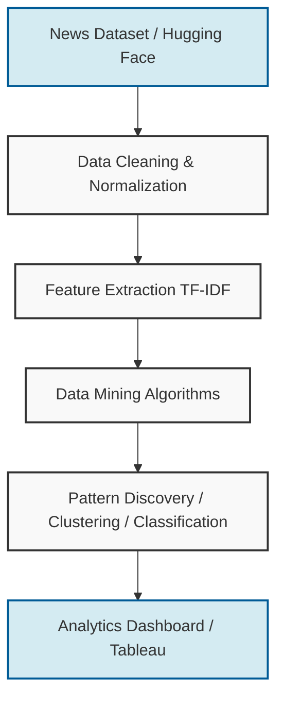
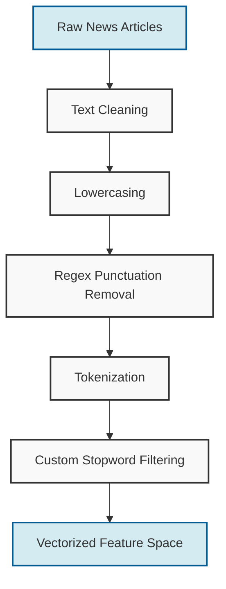
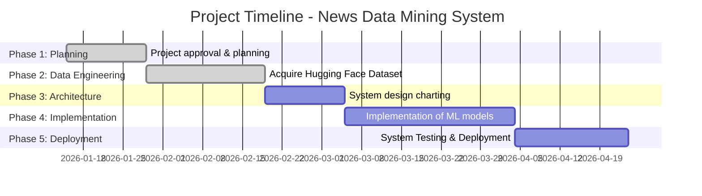

# Automated Data Mining and Pattern Discovery System for Unstructured News Corpora

## Section 1 — Introduction

In the contemporary digital era, the exponential growth of large, unstructured text datasets has created both significant computational challenges and unprecedented opportunities for knowledge discovery. The proliferation of digital media, social networks, and continuous online publishing has generated vast repositories of textual information. Among these repositories, news datasets are particularly valuable for data mining research. News articles encapsulate a continuous, real-time record of global events, evolving public sentiment, economic shifts, and societal trends. Examining such corpora allows researchers to decode latent structures within human communication and event reporting.

The importance of discovering patterns and trends in news corpora cannot be overstated. From predicting market volatility based on financial news to detecting the emergence of geopolitical crises, the automated extraction of semantic patterns provides actionable intelligence across numerous domains. However, the unstructured nature of raw text necessitates advanced mining techniques to transform linguistic data into structured, analyzable formats.

Therefore, the primary goal of this project is to architect and implement an intelligent system capable of automatically processing, analyzing, and extracting meaningful patterns from massive unstructured news corpora. By seamlessly integrating data warehousing, natural language processing, and data mining algorithms, the proposed system aims to convert disparate news articles into a cohesive, searchable, and analytically rich knowledge base.

To provide a high-level overview of the end-to-end system design, the core operational flow is illustrated below:

*Figure 1: High-level system architecture demonstrating the end-to-end data mining pipeline from raw ingestion to visualization.*

---

## Section 2 — Dataset Description

The empirical foundation of this project is built upon comprehensive and publicly available news datasets, ensuring both the scalability of the system and the reproducibility of the research. Prominently, the system utilizes the robust **AG News Dataset** sourced via the Hugging Face repository, representing a diverse aggregate of journalistic sources, topic categories, and publication timelines.

For the purpose of Concepts of Data Mining (CDM) experimentation, this dataset has been completely **isolated and frozen** in a dedicated analytical warehouse. Freezing the dataset ensures that all downstream clustering, classification, and association rule mining algorithms produce deterministic, repeatable, and academically verifiable results without structural drift.

Structurally, the schema includes the following primary fields:
* **Title:** The headline of the news piece, serving as a concentrated summary of the text.
* **Content:** The primary unstructured body of the article containing the detailed narrative.
* **Published Date:** The temporal timestamp enabling time-series mining.
* **Source:** The journalistic entity or publisher responsible for the article (e.g., Reuters, AP).
* **Category:** Thematic classifications (World, Sports, Business, Technology) assigning the article to a specific domain.

---

## Section 3 — Dataset Snapshot

To provide a concrete understanding of the dataset's structural composition, the following table presents a snapshot of the raw data prior to any normalization or preprocessing interventions. 

| ID | Title | Content | Category | Source | Published Date |
| :--- | :--- | :--- | :--- | :--- | :--- |
| **0** | Wall St. Bears Claw Back... | Wall St. Bears Claw Back Into the Black (Reuters) Reuters - Short-sellers, Wall Street's dwindling band of ultra-cynics... | Business | Reuters | 2018-09-10 |
| **1** | Phelps, Thorpe Advance in... | Phelps, Thorpe Advance in 200 Freestyle (AP) AP - Michael Phelps took care of qualifying for the Olympic 200-meter... | Sports | AP | 2021-03-14 |
| **2** | 'Dinosaur' bugs yield clue... | 'Dinosaur' bugs yield clue to evolution - Scientists have discovered a new species of insect... | Technology | Unknown | 2023-10-05 |

*Table 1: Representative snapshot of the raw frozen dataset illustrating structural fields before algorithmic preprocessing.*

This snapshot represents the raw, unstructured state of the data. The inherent noise, varying formats, and linguistic complexities visible in the *Content* column underscore the necessity for rigorous data cleaning protocols.

---

## Section 4 — Dataset Statistics

To validate the scale and diversity of the chosen corpus, exploratory statistical analysis was conducted on the frozen dataset. The foundational metrics of the corpus are detailed below:

| Metric | Value |
| :--- | :--- |
| **Total Articles** | 120,000 |
| **Unique Categories** | 4 (World, Sports, Business, Technology) |
| **Dataset Source** | Hugging Face (AG News subset) |
| **Environment State** | Completely Static (Frozen) |
| **Temporal Range** | 2018–2024 |

*Table 2: Corpus-level descriptive statistics highlighting dataset volume and structural diversity.*

These metrics confirm that the dataset possesses the sufficient volume, temporal baseline, and categorical variance required to train robust machine learning models and discover statistically significant patterns.

---

## Section 5 — Feature Selection

Feature selection is a pivotal phase in the data mining lifecycle, directly influencing the efficacy of text classification, clustering, and trend analysis. The following table outlines the foundational features curated for this project.

| Feature Name | Data Type | Description | Purpose in Data Mining |
| :--- | :--- | :--- | :--- |
| `title` | Text | The headline of the news | Semantic keyword extraction |
| `content` | Text | The unstructured body | High-dimensional TF-IDF vectorization |
| `published_at` | DateTime | Timestamp | Time-series trend analysis |
| `source` | Categorical | Publisher (e.g. Reuters) | Source bias / Association rule mining |
| `category` | Categorical | Thematic topic label | Supervised Classification (Naive Bayes) |

*Table 3: Feature description detailing data types and analytical descriptions.*

---

## Section 6 — Raw Data Example

Natural language data inherently contains syntactical anomalies, punctuation, and grammatical filler that do not contribute to semantic data mining. Below are two verbatim examples extracted from the raw dataset.

**Document 0:**
> "Phelps, Thorpe Advance in 200 Freestyle (AP) AP - Michael Phelps took care of qualifying for the Olympic 200-meter freestyle..."

**Document 1:**
> "Wall St. Bears Claw Back Into the Black (Reuters) Reuters - Short-sellers, Wall Street's dwindling band of ultra-cynics, are seeing green again..."

These raw article examples demonstrate the presence of punctuation marks, mixed capitalization (casing), structural stopwords ("in", "of", "for", "the", "are"), and special characters. If fed directly into a machine learning algorithm, these artifacts would significantly deteriorate the mathematical models by creating a highly sparse, noisy, and inefficient feature space.

---

## Section 7 — Data Preprocessing Pipeline

To optimize the raw text for algorithmic pattern discovery, a rigorous custom data preprocessing pipeline is implemented in isolated Python analytics modules. This phase reduces the dimensionality of the text while isolating its core semantic value. 

The sequential flow of this normalization process is visualized below:

*Figure 2: Data preprocessing pipeline used to transform raw news articles into normalized tokens suitable for feature extraction.*

---

## Section 8 — Cleaned Data Example

Following the execution of the custom preprocessing pipeline outlined in Section 7, the raw documents undergo a fundamental transformation. The resultant text represents a dense sequence of semantically potent tokens.

**Document 0 Cleaned:**
> `phelps thorpe advance freestyle michael phelps took care qualifying olympic meter freestyle`

**Document 1 Cleaned:**
> `wall bears claw black short sellers wall street dwindling band ultra cynics seeing green`

This cleaned, normalized text serves as the direct input for the mathematical feature extraction methodologies (e.g. TF-IDF) and subsequent Unsupervised KMeans algorithms. By eliminating noise, the system ensures that pattern recognition focuses strictly on topical vocabulary and thematic terminologies.

---

## Section 9 — Feature Extraction Techniques

Before textual data can be evaluated by computational algorithms, it must be vectorized into numerical representations. The system employs multiple feature extraction techniques collaboratively to capture different facets of the news text.

| Method | Type | Description | Purpose |
| :--- | :--- | :--- | :--- |
| **Tokenization** | Preprocessing | Splits text into individual words. | Converts monolithic text strings into manipulatable tokens. |
| **Stopword Removal** | Cleaning | Removes common graphical auxiliary words. | Retains only high-information semantic terms. |
| **TF-IDF Vectorization**| Weighted Feature | Penalizes terms frequent across all documents. | Highlights unique, defining terms for specific articles. |
| **KMeans Algorithms**  | Unsupervised | Euclidean distance grouping | Discovers latent subgroups within the corpus. |
| **Naive Bayes**        | Supervised   | Probabilistic multi-class modeling | Predicts category based on lexical probability. |

*Table 4: Comprehensive comparison matrix of feature extraction techniques utilized in the mining architecture.*

---

## Section 10 — Dashboard Requirements

To democratize access to the insights generated by the underlying data mining engine, a comprehensive, interactive analytics dashboard will be developed, alongside professional Tableau visualizations. 

The dashboard requirements encompass the following visualization modules:
* **Top Keyword Frequency Charts:** Bar charts and word clouds displaying the most prevalent topics.
* **Category Distribution Charts:** Pie charts depicting the proportional spread of articles across various news categories.
* **Temporal Trend Analysis:** Interactive line graphs tracking the volume of articles over time.
* **Source-wise Article Distribution:** Comparative analytics illustrating the volume of different publishers within the corpus (Reuters vs AP vs Unknown).
* **Algorithmic Demonstrations:** Live UI triggers to run KMeans and Naive Bayes on the frozen dataset.

---

## Section 11 — Exploratory Data Visualization (Tableau)

To better understand the structural distribution of the dataset and identify potential correlations among attributes, exploratory data visualizations were created using **Tableau** against the 120,000 row frozen dataset. 

These visualizations provide insight into category distributions, publication trends, keyword prominence, and source activity. The results guide the design of the final analytics dashboard and support the identification of meaningful patterns within the news corpus.

*(Note: The following placeholder figures represent the Tableau dashboards to be embedded)*

****
*Figure 3: Category Distribution — A packed bubble chart illustrating the perfectly balanced nature of the dataset, containing exactly 30,000 articles for each primary news category (World, Sports, Business, Technology).*

****
*Figure 4: Articles Published Over Time — Demonstrates the temporal patterns and publication frequency over the dataset's chronological range.*

**[Insert Tableau Bar Chart Here]**
*Figure 5: Source Distribution — Maps the dataset diversity by showcasing the volume of articles contributed by prominent publishers (Reuters, AP) vs unlabeled aggregates.*

---

## Section 12 — Project Schedule (Gantt Chart)

The successful engineering of this system depends on disciplined project management and a sequenced execution pipeline. The timeline is divided into five distinct operational phases.

| Phase | Activity | Deliverable |
| :--- | :--- | :--- |
| **Phase 1** | Project approval and requirement gathering | Approved formal project proposal |
| **Phase 2** | Dataset acquisition, schema design, and analysis | Processed Dataset + Validated Features |
| **Phase 3** | System architecture and pipeline design | System Architecture Documentation |
| **Phase 4** | Implementation of data mining algorithms | Trained and functional ML Models |
| **Phase 5** | Testing, evaluation, and GUI Deployment | Fully functional, tuned system |

*Table 5: High-level overview of project execution phases and corresponding deliverables.*

*Figure 6: Gantt chart delineating the chronological orchestration of project phases.*
