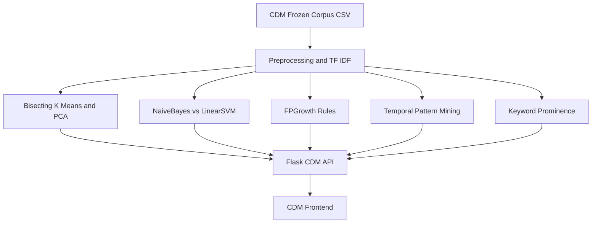
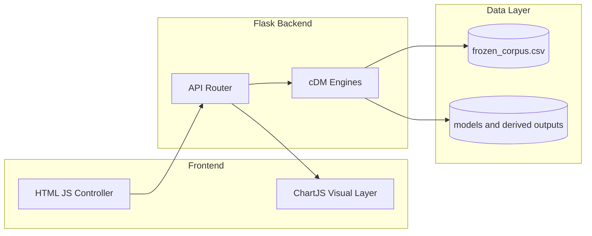
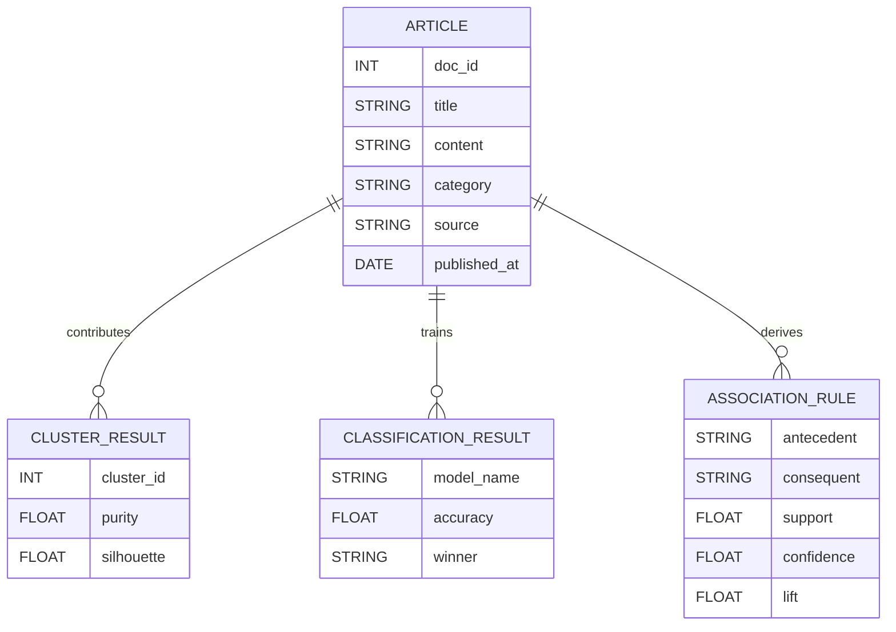

# CDM Review 2 Document: System Design
**Concepts of Data Mining**

## 1. Data Analytics Design

The CDM module performs reproducible mining on a frozen corpus and returns structured JSON to a single frontend dashboard.

- **Objective:** Discover category structure, class boundaries, keyword associations, and temporal trends from unstructured news text.
- **Fixed Data Policy:** CDM uses only `frozen_corpus.csv`; it does not use live IRT updates.

### Pipeline Diagram

### Algorithm Selection and Justification
- **Bisecting K-Means + LSA:** stable clustering for sparse high-dimensional text vectors.
- **Naive Bayes vs Linear SVM:** benchmark both classifiers and keep best performer.
- **FP-Growth (not Apriori):** memory-efficient association rule mining for large text transactions.
- **PCA/SVD projection:** converts high-dimensional features to 2D visualization space.

## 2. High-Level System Architecture Design

The system uses a decoupled client-server architecture with strict endpoint contracts.

### API Specification (Current)
- `GET /api/cdm/stats`
- `POST /api/cdm/cluster`
- `GET /api/cdm/elbow`
- `POST /api/cdm/classify`
- `POST /api/cdm/predict`
- `POST /api/cdm/pca`
- `POST /api/cdm/association`
- `POST /api/cdm/temporal`
- `POST /api/cdm/keywords`

## 3. Database / Dataset Design

- **IRT storage engine:** DuckDB for dynamic and live/updating retrieval corpus.
- **CDM analysis dataset:** frozen CSV for repeatable mining and review consistency.
- **Contract:** CDM endpoints are guarded to fail if frozen corpus is missing.

### Conceptual Data Model (CDM)

## 4. Screen / Input / Form Design

- Main interface: `index.html` with CDM sidebar modules.
- Each module has explicit run controls and structured outputs.
- New review hardening additions:
  - Status badges: `Not Run`, `Running`, `Success`, `Failed`
  - Standard output blocks: `Method`, `Input Params`, `Key Metrics`, `Interpretation`
  - Parameter hints for clustering and association thresholds
  - Review Mode toggle for compact demo flow

## 5. Visualization / Graph / Chart Design

- **Clustering:** cluster cards + purity/silhouette + PCA scatter.
- **Classification:** dual model scorecards + confusion matrices + live predict confidence.
- **Association:** rule cards with support/confidence/lift chips.
- **Temporal:** trend lines and cross-category correlation chips.
- **Keywords:** global and category-defining TF-IDF term visualizations.

## 6. Test Data and Test Case Design

### 6.1 Test Methodology
- Component integration tests through real API calls.
- Boundary testing for invalid params and empty result scenarios.
- Frozen-dataset contract validation.

### 6.2 Validation Snapshot
- Automated endpoint run: `python code/backend/test_api.py`
- Result: **12/12 tests passed**

| Endpoint | Payload | Expected Core Fields | Status |
| :--- | :--- | :--- | :--- |
| `/api/cdm/stats` | none | total_docs, vocabulary_size | Pass |
| `/api/cdm/cluster` | `{"n_clusters":3}` | clusters, silhouette_score, overall_purity | Pass |
| `/api/cdm/elbow` | none | k_values, inertia, recommended_k | Pass |
| `/api/cdm/classify` | `{}` | naive_bayes, svm, winner, accuracy_delta | Pass |
| `/api/cdm/predict` | text input | predicted_category, confidence | Pass |
| `/api/cdm/pca` | `{"n_clusters":3,"sample_size":200}` | points, cluster_labels | Pass |
| `/api/cdm/association` | support/confidence | rules, lift metrics | Pass |
| `/api/cdm/temporal` | `{}` | category_trends, correlation | Pass |
| `/api/cdm/keywords` | `{"top_n":10}` | global_top_terms, category_defining_terms | Pass |

## 7. Issues Faced and Resolutions

1. **High memory pressure in large text mining**
   - Resolution: feature bounds and sampling where required.
2. **Review reproducibility risk from live data**
   - Resolution: strict frozen-corpus-only CDM contract.
3. **Frontend clarity and demo reliability**
   - Resolution: status badges, standard result layout, actionable errors, review mode.

## 8. Review-2 Conclusion

The CDM system design is now aligned with implementation:
- correct algorithms (FP-Growth, Bisecting K-Means, SVM/NB benchmark),
- correct `/api/cdm/*` endpoint contracts,
- strict data separation from IRT live pipeline,
- review-ready frontend behavior and verifiable endpoint evidence.
