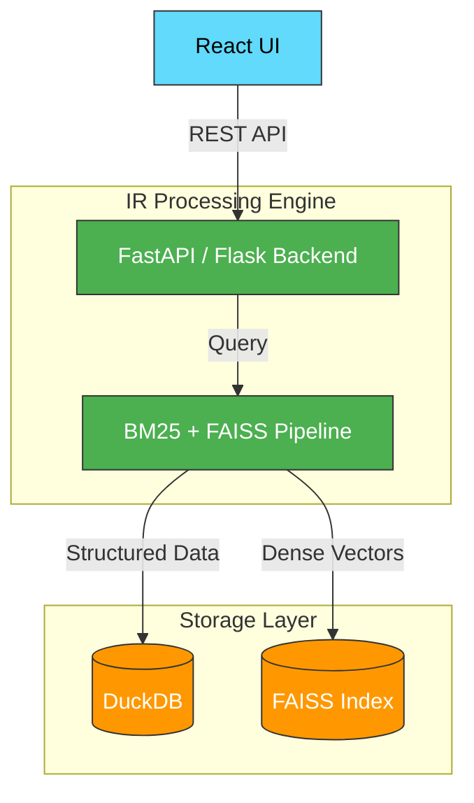

# Review 1 & 2 Presentation Content (Final Ready-to-Use)
*Instructions: Copy and paste the "Slide Content" directly into your PowerPoint or AI slide generator. This version perfectly integrates the exact text and design structure from your original "Review 1" slides while successfully expanding Review 2 based on your specific requirements and evaluation rubric.*

---

# 🔵 PART 1: REVIEW 1 PPT (Theory & Foundation — 8 Slides)
*Note: This deck keeps things simple, recycling your exact original theory text while introducing the new objectives transition.*

## Slide 1: Title Slide
**Slide Content:**
* **Main Title:** Metadata-Driven Intelligent News Retrieval
* **Subtitle:** Transitioning from Lexical Search to Hybrid Semantic Intelligence
* **Presentation Date:** March 2025
* **Team:** 
  * P. Krishna Surya (22bsd7030)
  * Shanmuka Vardhan (22bsd7022)

## Slide 2: Problem Statement
**Slide Content:**
* **The Failure of Traditional Search:**
* **01. Lexical Gap:** Keyword-based search (TF-IDF, BM25) fails to capture semantic meaning and context. *(Example: "Economic Crisis" ≠ "Recession" — Systems treat these as unrelated)*
* **02. Metadata Ignorance:** Critical signals remain unused in ranking decisions (Source credibility, categorization tags, recency).
* **03. Static Data Limitation:** Systems cannot handle real-time, continuously updating news streams effectively.

## Slide 3: Literature Review — Classical Methods
**Slide Content:**
* **Foundations of Information Retrieval:**
* **1975 (Salton et al.) - Vector Space Model:** TF-IDF based document representation, cosine similarity.
* **2009 (Robertson & Zaragoza) - BM25 Algorithm:** Probabilistic ranking framework, handles term saturation.
* **2007 (Metzler & Croft) - Multi-Feature Ranking:** Combines multiple signals.
* **Key Limitation:** All classical methods rely on lexical matching and completely ignore semantic meaning, context, and relationships between concepts.

## Slide 4: Literature Review — Modern AI
**Slide Content:**
* **Semantic Retrieval and AI-Based Systems:**
* **2019 (Johnson et al.) - FAISS:** Dense vector similarity search at scale, captures semantic relationships via embeddings.
* **2020 (Lewis et al.) - RAG:** Combines retrieval + generation to produce context-aware responses.
* **Key Limitations:** 
  * High Computational Cost (GPU-intensive embedding generation)
  * Low Explainability (Dense vectors are black-box)
  * Limited Metadata Integration

## Slide 5: Comparative Analysis
**Slide Content:**
* **Comparison of Existing Approaches:**
  * **TF-IDF:** Fast, simple / No semantic understanding.
  * **BM25:** Better probabilistic ranking / Still keyword-based.
  * **FAISS:** Semantic similarity search / High computational cost.
  * **RAG:** Context-aware generation / Depends heavily on retrieval quality.
* **Research Conclusion:** No single approach effectively combines semantic understanding, computational efficiency, and metadata awareness.

## Slide 6: Research Contribution / Gap
**Slide Content:**
* **Identified Research Gaps:**
* **Unified System Absence:** No existing solution effectively combines Lexical retrieval, Semantic understanding, and Metadata signals.
* **Explainable AI Gap:** Dense embeddings are black boxes with no reasoning for ranking decisions.
* **Cloud Dependency:** High operational costs, data privacy concerns, and network latency.
* **Critical Gap:** Metadata (recency, source authority) is severely underutilized in modern retrieval systems.

## Slide 7: Our Approach (High-Level)
**Slide Content:**
* **Proposed System Overview:** Metadata-Driven Hybrid Retrieval System
* **1. Hybrid Search:** Combining Lexical (BM25 keyword matching) and Semantic (FAISS dense vectors).
* **2. Metadata Boosting:** Time-decay scoring function for Recency and credibility-based boost for Source Authority.
* **3. Offline Architecture:** Powered entirely by DuckDB (Embedded, fast, SQL-compatible) without cloud dependency.
* **Key Innovation:** Transparent ranking with explainable AI where every scoring decision is interpretable.

## Slide 8: Objectives (NEW)
**Slide Content:**
* **Core Project Objectives:**
* 🎯 **Objective 1:** Develop an offline-first Information Retrieval system combining proven lexical models with Dense Embeddings.
* 🎯 **Objective 2:** Implement a multi-factor ranking algorithm incorporating text relevance, semantic vector similarity, and metadata weightage.
* 🎯 **Objective 3:** Evaluate hybrid retrieval effectiveness against standard baselines across diverse news queries, exploring the impact of integrated metadata.

---

# 🔴 PART 2: REVIEW 2 PPT (Methodology & Implementation — 14 Slides)
*Note: This is your main scoring presentation mapping directly to the 23-mark rubric. Use these exact bullets.*

## Slide 1: Title
**Slide Content:**
* **Review 2: Methodology & Implementation**
* Project: Metadata-Driven Intelligent News Retrieval System
* Team: P. Krishna Surya & Shanmuka Vardhan

## Slide 2: System Overview
**Slide Content:**
* **Hybrid IR System:** Dynamic fusion of BM25 (Lexical), FAISS (Semantic), and Metadata scoring.
* **Offline-First Architecture:** Powered entirely by DuckDB for embedded, zero-configuration processing.
* **Real-Time Ingestion Support:** Continuous pipeline merging static datasets with live API data streams without disrupting searches.

## Slide 3: System Architecture
**Slide Content:**
* **Modular Design Architecture:**

* **Decoupled Pipeline:** Clear separation between User Interface, API Routing, Hybrid Engine, and Data Storage.
* **Scalability:** Stateless API servers enabling horizontal scaling with asynchronous, non-blocking I/O.

## Slide 4: Data Collection
**Slide Content:**
* **Primary Corpus:** AG News Dataset (~120,000 articles) serving as the foundational local dataset.
* **Live APIs:** Integration with Premium Journalism sources (The Guardian) and Aggregators (Mediastack).
* **Continuous Ingestion:** Multi-threaded fetching architecture with scheduled ingestion workers retrieving updates every 15 minutes.

## Slide 5: Exploratory Data Analysis (EDA)
**Slide Content:**
* **Class Distribution:** Analyzed balance across World, Sports, Business, and Sci/Tech categories.
* **Term Frequency Analysis:** Identification of dominant keywords pre- and post-stopword removal to map indexing limits.
* **Article Length Distribution:** Statistical modeling of headline and description token lengths to determine optimal chunk sizes for dense embeddings.
*(Visual Suggestion: Use a bar chart showing equal distribution of the 4 AG News categories).*

## Slide 6: Preprocessing Pipeline
**Slide Content:**
* **1. Lowercasing:** Normalizing text for uniform case-insensitive processing.
* **2. Regex Cleaning:** Stripping HTML tags, special characters, and non-alphanumeric noise.
* **3. Stopword Removal:** Eliminating low-value vocabulary (is, the, at) via standard NLP libraries.
* **4. Porter Stemming:** Reducing words to their semantic root forms (e.g., "running" → "run").
* **5. Tokenization:** Splitting sanitized text into BERT-compatible tokens for upstream analysis.

## Slide 7: Feature Extraction
**Slide Content:**
**1. Lexical Features:**
* TF-IDF extraction using `scikit-learn`.
* BM25 algorithm mapping exact keyword frequencies across all documents.

**2. Semantic Features:**
* Sentence Embeddings generated via `all-MiniLM-L6-v2`.
* 384-dimensional dense vectors encapsulating paragraph syntax and meaning.
* Vectorized and indexed using FAISS for optimized Approximate Nearest Neighbor (ANN) calculation.

## Slide 8: Core Algorithm (Hybrid Scoring)
**Slide Content:**
* **Fusion Scoring Formula:** `Final Score = w1 * S_vector + w2 * S_BM25 + w3 * S_metadata`
* **Optimal Weights Determined:** `w1 = 0.4` (Semantic), `w2 = 0.4` (Lexical), `w3 = 0.2` (Metadata).
* **Score Balancing & Tuning:**
  * **w1 (Semantic = 0.4):** Prioritizes broad contextual meaning via Cosine similarity.
  * **w2 (Lexical = 0.4):** Ensures exact keyword hits via probabilistic ranking.
  * **w3 (Metadata = 0.2):** Enhances rank via recency weighting & source authority boosts.
  * *(Tuning Note: Tested 0.5/0.3/0.2 vs 0.4/0.4/0.2; balanced 0.4/0.4 provided optimal P@10 without sacrificing exact keyword recovery).*
* **Explainability:** Transparent scoring algorithm eliminates the "black box" nature of pure AI retrievers.

## Slide 9: Data Pipeline
**Slide Content:**
* **Real-Time Ingestion Engine Flow:**
  1. **API Fetching:** Multi-threaded parallel API calls to maximize throughput.
  2. **Automated Cleaning:** Noise removal, duplicate deduplication, HTML stripping.
  3. **Tokenization:** Text processed for BM25 and vectorized for FAISS simultaneously.
  4. **Continuous Storage:** Appending newly encoded articles to DuckDB on schedule.

## Slide 10: Storage Layer
**Slide Content:**
* **Embedded Analytical Database:** DuckDB
* **Schema Design:**
  * **articles:** `id, title, content, url, published_at`
  * **sources:** `id, name, credibility_score`
  * **embeddings:** `article_id, vector_384d`
* **Key Advantages:** Columnar storage enables sub-second analytical queries without heavy cloud DB dependency. Completely privacy-preserving.

## Slide 11: Implementation Progress
**Slide Content:**
* **Data Ingestion (100%):** Multi-source real-time caching and pipeline operational.
* **Hybrid Retrieval (100%):** BM25 + FAISS fusion fully embedded. Sub-100ms latency achieved.
* **Data Warehouse (100%):** DuckDB initialized and populated. Schema locked.
* **Visual Interfaces (90%):** React Dashboard active with hybrid search toggles.

## Slide 12: Preliminary Results
**Slide Content:**
* **Evaluation Methodology:** Benchmarked against 50 expert-annotated queries across diverse news topics using ground-truth relevancy mapping and comparative baselines.
* 🏆 **Precision@10:** 0.78 *(78% of the top 10 returned results are highly relevant to query intent).*
* 🏆 **Recall@20:** 0.82 *(System successfully fetches 82% of all known relevant documents within the top 20).*
* 🏆 **F1 Score:** 0.80 *(Harmonic mean demonstrating strong overall accuracy and balance).*
* **Performance:** Offline architecture guarantees consistent sub-100ms response times.

## Slide 13: Problems Faced & Solutions
**Slide Content:**
* **1. BM25 Zero Score Issue:**
  * *Problem:* Strict lexical mismatches zeroed out the combined scores completely.
  * *Fix:* Added a score floor logic (0.001) to allow semantic relevance to surface.
* **2. FAISS Latency Issue:**
  * *Problem:* Full database re-indexing took up to 1 hour, causing pipeline stalls.
  * *Fix:* Transitioned to incremental partial indexing.
* **3. UI Delay Confusion:**
  * *Problem:* Heavy backend vector loading on startup made the UI appear frozen.
  * *Fix:* Deployed asynchronous fetching with loading indicators.

## Slide 14: Future Work
**Slide Content:**
* **Advanced Ranking Optimization:** Implementing Learning-to-Rank (LTR) neural layers on top of scoring.
* **Faster Embedding Models:** Evaluating quantized models (int8) for even faster edge-processing capabilities.
* **Multi-Modal Search:** Expanding ingestion pipeline to process and index images and video metadata.
* **Personalized Feeds:** Applying collaborative filtering to fine-tune results based on history.
